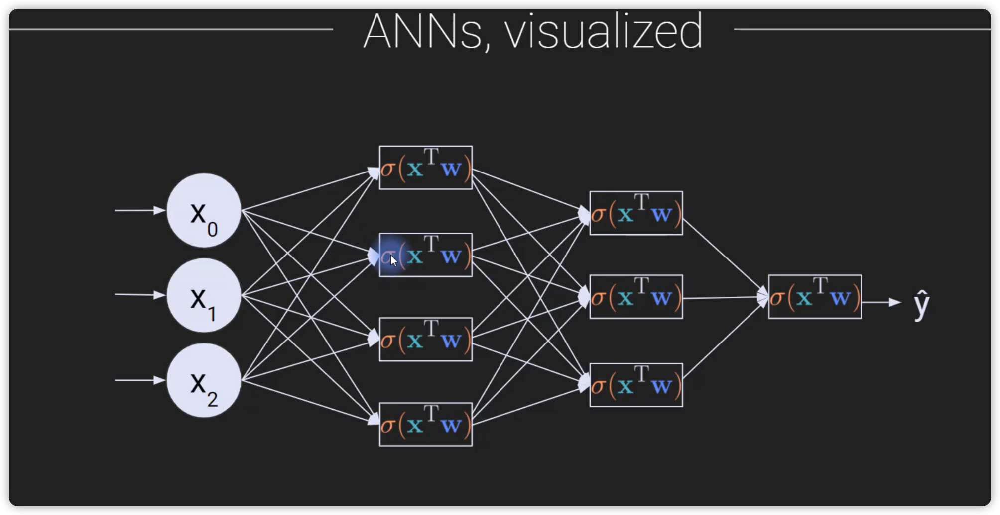
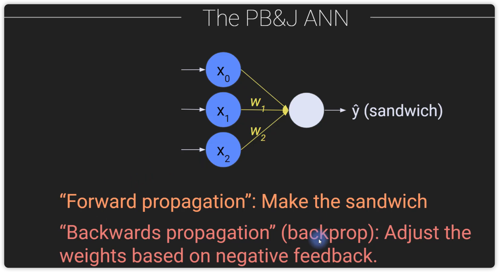

# DeepLearning - 01

## Deep learning Concept 
* ANN 
    * Input -> transformation - equation(ANN/CNN/RNN) -> Output 
    * y = x1*w1 + x2*w2
    * 
    * 

Philosophy of deep learning
* lots of small, simple things is better than one complex thing 